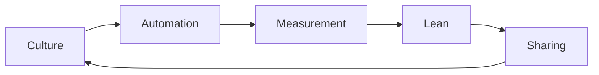

# 🐳 **Introducción a Docker y DevOps para Estudiantes**
> *Aprende a construir, probar y entregar software como lo hacen las empresas modernas —sin abrumarte.*

---


=== "¿Qué es DevOps?"

    ### (Y por qué deberías conocerlo en tu rol de estudiante—)

    Imagina esto:

    > Tú y tu grupo terminan una app genial para el proyecto de la clase.  
    > El código funciona **perfecto** en sus laptops…  
    > Pero al entregarlo al profesor para probarlo…  
    > ❌ *“No me corre”*, dice.  
    > ❌ *“Me falta una librería”*, dice otro.  
    > ❌ *“Cambió la versión de Python y ahora todo se rompe”*, dice un tercero.

    ¡Uff! 😩  
    Ese es el **problema que DevOps ayuda a resolver**.

    ---

    ### 💡 En una frase simple:

    > **DevOps es una forma de trabajar donde los que desarrollan software (*Dev*) y los que lo ponen a funcionar en servidores (*Ops*) dejan de pelearse… ¡y empiezan a colaborar como un solo equipo!**

    No es una herramienta. No es un cargo.

    Es una **cultura**, un **mindset**, y un conjunto de **prácticas** para que el software:

    - ✅ Se construya más rápido  
    - ✅ Funcione igual en todas partes  
    - ✅ Se entregue sin miedo (¡hasta varias veces al día!)  
    - ✅ Se recupere rápido si algo falla

    ---

    ### 🧩 **Las 3 ideas clave de DevOps (fáciles de recordar)**

    | Idea | ¿Qué significa? | Ejemplo estudiantil 🎓 |
    |------|-----------------|------------------------|
    | **Automatización** | Que las computadoras hagan lo aburrido (y propenso a errores) | En vez de instalar manualmente Python, Flask y Redis en cada laptop… usas un `Dockerfile` que lo hace en 10 segundos ⏱️ |
    | **CI/CD**<br>(*Integración y Entrega Continua*) | Cada cambio de código se prueba y despliega *automáticamente* | Subes tu código a GitHub → un robot lo prueba → si todo pasa, lo sube solo a un servidor web 🤖🚀 |
    | **Colaboración + Feedback rápido** | Romper silos: devs, testers, sysadmins hablan desde el día 1 | En tu grupo: el que sabe de front, el de back y el de BD diseñan juntos la API… no al final, sino desde la semana 1 🤝 |

    ---

    ### 🛠️ Herramientas que verás (y usarás pronto)

    | Categoría | Herramientas comunes | ¿Para qué sirven? |
    |----------|----------------------|-------------------|
    | 🐳 **Contenedores** | Docker, Podman | Empaquetar apps para que "corran igual en todas partes" |
    | 🔄 **CI/CD** | GitHub Actions, GitLab CI, Jenkins | Automatizar pruebas y despliegues |
    | ☁️ **Infraestructura como Código (IaC)** | Terraform, Ansible | Crear servidores con código (¡como `docker run`, pero en la nube!) |
    | 📊 **Monitoreo** | Prometheus, Grafana | Ver si tu app está lenta, caída o usando mucha RAM |


    👉 **No necesitas aprenderlas todas ahora**.  
    Empieza con **Git + Docker + GitHub Actions** → ya estarás haciendo *mini-DevOps*.

    ---

    ### 🌱 ¿Por qué a ti, como estudiante, te importa?
    - 📈 **Las empresas lo piden**: +70 % de ofertas de desarrollo incluyen "experiencia con DevOps".
    - 🧪 **Te ahorra horas** en proyectos grupales (¡adiós, *"funciona en mi máquina!"*).
    - 🚀 **Te da ventaja en pasantías**: si sabes automatizar despliegues, ya vales más que muchos juniors.
    - 🔓 **Te prepara para lo real**: el mundo no quiere solo programadores… quiere **personas que entreguen valor, rápido y con calidad**.

    > ✨ *“DevOps no es sobre herramientas.  
    > Es sobre reducir el tiempo entre tener una idea…  
    > y que esa idea le entregue valor a alguien.”*  
    > — Adaptado de Gene Kim


=== "Origen de DevOps"  
    ## La historia detrás del movimiento que cambió la forma de construir software

    ---

    > 💡 **DevOps no fue inventado en un laboratorio.**  
    > Nació del **dolor real**, de noches sin dormir, despliegues fallidos y reuniones donde Dev y Ops se miraban como enemigos.  
    > Es la respuesta a una pregunta muy simple:  
    > > ***“¿Por qué si el código funciona en desarrollo… se rompe en producción?”***

    ---

    ## 📉 El problema que nadie quería admitir

    Hasta principios de los 2000, el ciclo de vida del software era más o menos así:

    [ Desarrollo ]
        │
        ▼
        (Entrega un ZIP o un JAR)
        │
        ▼
        [ Operaciones ] ← "¡Oiga, esto no corre en los servidores!"
        │
        ▼
        [ Producción ] ← Caídas, correos a medianoche, culpas cruzada
    
    
    Este modelo tenía **3 grandes grietas**:

    |Problema | Consecuencia |
    |-------|--------------|
    | ❌ **Silos organizacionales** | Los desarrolladores (*Dev*) se medían por *entregas de código*. Los operadores (*Ops*) por *estabilidad*. ¡Metas opuestas! |
    | ❌ **Entregas manuales y raras** | Un despliegue cada 3 meses… con 2 semanas de preparación y una noche de "mantenimiento" (traducción: oración y café). |
    | ❌ **Falta de feedback rápido** | Un bug encontrado en producción podía tardar *días* en llegar al equipo que lo escribió. |

    👉 El resultado: **software lento, frágil y caro de mantener**.

    ---

    ## 🔁 El intento de Agile… y su límite

    En 2001 nació el **Manifiesto Ágil**, con principios revolucionarios:
    > ✅ *“Entrega continua de software útil”*  
    > ✅ *“Colaboración diaria entre patrocinadores y desarrolladores”*  
    > ✅ *“Respuesta ágil al cambio”*

    Pero…  
    🎯 **Agile se quedó en desarrollo**.  
    Ops seguía fuera del sprint. La “última milla” (llevar el software a producción) seguía siendo un *valle de lágrimas*.

    > 🎯 **Metáfora**:  
    > Agile enseñó a correr rápido… pero con zapatos atados entre sí.  
    > DevOps desató los cordones.

    ---

    ## 🧩 El “clic”: de la teoría a la práctica

    Tres ideas convergieron para hacer posible DevOps:

    ### 1. 📚 **La teoría de las restricciones** (*The Goal*, 1984)
    - Libro de **Eliyahu Goldratt**, escrito como novela.
    - Idea clave: *“Todo sistema tiene un cuello de botella. Mejorar fuera de él no sirve.”*
    - En software: el cuello de botella era **la transición entre Dev y Ops**.

    ### 2. 🛠️ **Automatización + Infraestructura como Código (IaC)**
    - Herramientas como **Puppet (2005)** y **Chef (2009)** permitieron definir servidores… ¡con código!
    - Ya no había que configurar cada máquina a mano → se podían replicar entornos *idénticos*.

    ### 3. ☁️ **La revolución de la nube**
    - AWS lanzó EC2 en 2006. De pronto, crear un servidor tomaba **minutos**, no semanas.
    - Esto hizo posible probar, desplegar y escalar… sin pedir permiso al área de infraestructura.

    ---

    ## 🎉 El nacimiento oficial: 2008–2009

    | Momento | Qué pasó |
    |--------|----------|
    | **Agosto 2008** | En la conferencia *Agile 2008* (Toronto), **Patrick Debois** —un consultor belga— escucha una charla sobre *10+ deploys per day* en Flickr. Se da cuenta: *“¡Ellos sí integran Dev y Ops!”*. Frustado porque en su proyecto no podía hacer lo mismo, decide actuar. |
    | **Octubre 2009** | Patrick organiza en **Gante (Bélgica)** la primera **DevOpsDays** —una mezcla de conferencia y *unconference*. Invita a devs, sysadmins, testers… todos con el mismo dolor. |
    | **Noviembre 2009** | Para acortar el hashtag del evento en Twitter, usa **#DevOps**. El término se viraliza. 🚀 |

    > 📌 **Patrick Debois** no inventó las prácticas…  
    > pero **dio nombre al movimiento** y construyó la comunidad que lo hizo crecer.

    ---

    ## 🌍 ¿Por qué DevOps *tenía* que nacer?

    | Fuerza impulsora | Explicación |
    |------------------|-------------|
    | **Velocidad del negocio** | Empresas como Amazon y Netflix competían en *tiempo*: quien sacaba funcionalidades más rápido, ganaba. |
    | **Complejidad creciente** | Aplicaciones ya no eran monolitos: eran microservicios, APIs, bases de datos distribuidas… imposibles de gestionar manualmente. |
    | **Cultura open source** | La mentalidad de “compartir, colaborar, mejorar juntos” (como en Linux o Git) se extendió a procesos. |
    | **Fallos costosos** | Un despliegue fallido en Amazon podía costar **$millones/minuto**. La estabilidad dejó de ser “bonita”… y se volvió *estratégica*. |

    ---

    ## 🧠 En resumen: DevOps nace de…

    | Origen | Se traduce en… |
    |--------|----------------|
    | 🧩 **Problemas reales** (entregas rotas, noches de crisis) | → Necesidad de **confiabilidad** |
    | 🤝 **Frustración cultural** (Dev vs. Ops) | → Necesidad de **colaboración** |
    | 🤖 **Avances técnicos** (nube, contenedores, CI/CD) | → Posibilidad de **automatizarlo todo** |
    | 📈 **Presión del mercado** (innovar o morir) | → Urgencia de **entregar valor rápido** |

    > ✅ DevOps no es una moda.  
    > Es la **evolución natural** de cómo construimos software cuando la velocidad, la calidad y la colaboración son no negociables.

    ---

    ## 📚 Para seguir explorando (recomendado para estudiantes)

    | Recurso | Por qué leerlo/verlo |
    |---------|----------------------|
    | 📘 [*The Phoenix Project*](https://itrevolution.com/book/the-phoenix-project/) (novela) | La mejor forma de entender DevOps… ¡como si fuera una historia de suspense empresarial! |
    | 🎥 [What is DevOps? (TechWorld with Nana)](https://youtu.be/7bZ79qZkZ6o) | Explicación visual y clara en 10 minutos. |
    | 📊 [State of DevOps Reports (DORA)](https://cloud.google.com/devops) | Datos reales: qué prácticas sí mejoran desempeño (spoiler: automatización y cultura). |

    ---

    > 🌟 **Reflexión final**:  
    > DevOps no nació para que uses más herramientas.  
    > Nació para que **pases menos tiempo arreglando lo que se rompió…  
    > y más tiempo creando lo que importa.**  

    🚀 ¿Listo para ser parte de la solución?


=== "Cultura DevOps"

    # 🌱 ¿Qué es y en qué consiste la **cultura DevOps**?  
    ## Porque DevOps no es Docker… es *cómo trabajamos juntos*

    > 💬 *"Herramientas no hacen DevOps. Las personas sí.  
    > Y las personas necesitan una cultura que las respalde."*  
    > — Adaptado de Gene Kim

    ---

    ## ❌ Lo primero: ¿Qué **NO** es la cultura DevOps?

    | Mito | Realidad |
    |------|----------|
    | ✖️ *"Es un equipo nuevo: 'el equipo DevOps'"* | ✔️ DevOps no es un cargo ni un departamento. <br> Es una **forma de trabajar entre todos**. |
    | ✖️ *"Basta con instalar Jenkins y Docker"* | ✔️ Las herramientas son necesarias… pero sin cultura, solo automatizas el caos. |
    | ✖️ *"Es solo para empresas grandes"* | ✔️ Un grupo de 4 estudiantes puede aplicar cultura DevOps en su proyecto final. |

    ---

    ## ✅ Entonces… ¿qué **SÍ** es la cultura DevOps?

    Es un conjunto de **valores, principios y comportamientos** que permiten a los equipos:

    > 🎯 **Entregar valor al usuario, de forma rápida, segura y sostenible.**

    No se impone desde arriba.  
    Se cultiva día a día, con pequeñas decisiones.

    ---

    ## 🧭 Los 4 pilares de la cultura DevOps  
    *(Basados en el libro **"Accelerate"** —el estudio más grande sobre alto desempeño en TI)*

    === "**1. Flujo de trabajo (Flow)**"

        > *Minimizar el tiempo desde la idea hasta el usuario.*

        🔹 **Se manifiesta cuando…**  
        - Haces *commits* pequeños y frecuentes (no un mega-PR cada 3 semanas).  
        - Tienes entornos de prueba **idénticos a producción** (gracias a Docker, por ejemplo 🐳).  
        - Reduces los "cuellos de botella": aprobaciones manuales, reuniones innecesarias, colas de despliegue.

        🎯 **Métrica clave**: *Tiempo de ciclo* (desde código escrito → en producción).

        ---

    === "**2. Retroalimentación rápida (Feedback)**" 

        > *Detectar errores y oportunidades *antes*, no después.*

        🔹 **Se manifiesta cuando…**  
        - Tienes pruebas automatizadas que corren en **minutos**, no horas.  
        - Cada `git push` dispara una *pipeline* (CI/CD) que te dice: ✅ pasa / ❌ falla.  
        - El equipo de QA colabora desde el *diseño*, no solo al final.  
        - Haces *post-mortems sin culpa* (blameless retrospectives) cuando algo falla.

        🎯 **Métrica clave**: *Tiempo para detectar y resolver fallos*.

        ---

    === "**3. Aprendizaje y experimentación continua (Learning)**"  

        > *Fracasar rápido, aprender más rápido.*

        🔹 **Se manifiesta cuando…**  
        - Se celebra más por *lo que se aprendió* que por "no haber fallado".  
        - Haces experimentos pequeños: *feature flags*, A/B testing, despliegues canarios.  
        - Dedicas tiempo a *refactorizar*, *documentar* y *pagar deuda técnica*.  
        - Compartes conocimiento: tech talks, pair programming, repositorios abiertos.

        🎯 **Métrica clave**: *Frecuencia de experimentación y mejora del sistema*.

        ---

    === "**4. Responsabilidad compartida (Shared Ownership)**"  
        > *“No es mi problema” → “¿Cómo lo resolvemos juntos?”*

        🔹 **Se manifiesta cuando…**  
        - El desarrollador **no dice**: *“En mi máquina funciona”*.  
        - El operador **no dice**: *“Eso es problema de desarrollo”*.  
        - Todos monitorean producción (logs, métricas, alertas).  
        - Cualquiera puede (y debe) proponer mejoras en infraestructura, despliegue o código.

        🎯 **Métrica clave**: *Nivel de colaboración cruzada y autonomía del equipo*.

        ---

    ## 🧩 ¿Cómo se ve la cultura DevOps en la práctica?  
    ### Ejemplos reales (¡hasta en la universidad!)

    | Situación típica | Mentalidad *anti-DevOps* | Mentalidad *DevOps* |
    |------------------|--------------------------|---------------------|
    | **El proyecto falla en la entrega** | 👉 *"Fue culpa del que hizo el backend"* | 👉 *"¿Qué proceso permitió que esto llegara tan lejos? ¿Cómo lo evitamos?"* |
    | **Hay que desplegar** | 👉 Un solo compañero lo hace a medianoche, en secreto | 👉 El despliegue es automatizado, documentado y *cualquiera puede hacerlo con un botón* |
    | **Aparece un bug en producción** | 👉 Se apaga la app y se corrige a mano (sin tests) | 👉 Se activa alerta → equipo revisa logs → corrige → prueba → despliega → comparte hallazgos |
    | **Nuevo integrante al grupo** | 👉 *"Te mando un PDF de 50 páginas… si lo lees, suerte"* | 👉 *"Clona este repo → ejecuta `docker-compose up` → ya tienes todo listo. Te acompaño 1 hora."* |

    ---

    ## 🌱 Cómo empezar a construir cultura DevOps (como estudiante)

    No necesitas permiso. Empieza **hoy**, en tu próximo proyecto:

    | Acción pequeña | Impacto grande |
    |----------------|----------------|
    | ✅ Usa `git` desde el día 1 (no solo al final) | → Transparencia y trazabilidad |
    | ✅ Escribe un `README.md` con: *cómo instalar, cómo ejecutar, cómo probar* | → Empatía con quien recibe tu código |
    | ✅ Dockeriza tu app (aunque sea simple) | → “Funciona en mi máquina” **desaparece** |
    | ✅ Haz una retrospectiva de 15 min al terminar la entrega | → “¿Qué salió bien? ¿Qué mejoraríamos?” |
    | ✅ Comparte un enlace a tu repositorio público (GitHub) | → Mentalidad open, feedback externo |

    > ✨ **Recuerda**: La cultura no se construye en un día.  
    > Se construye cada vez que eliges *colaborar* en vez de culpar,  
    > *automatizar* en vez de repetir,  
    > y *aprender* en vez de esconder.

    ---

    ## 📊 Autoevaluación rápida: ¿Tu equipo tiene cultura DevOps?

    Responde sí/no:

    - [ ] ¿Cualquiera en el equipo puede desplegar a un entorno de prueba?  
    - [ ] ¿Tienen pruebas automatizadas (aunque sean 2)?  
    - [ ] ¿Hacen una reunión corta para ajustar el rumbo cada 1–2 semanas?  
    - [ ] ¿Documentan decisiones clave (ej: “por qué usamos SQLite y no PostgreSQL”)?  
    - [ ] ¿Celebrazan los aprendizajes, no solo los éxitos?

    ✅ **3+ sí** → ¡Van por buen camino!  
    🟡 **1–2 sí** → Buen punto de partida. Elijan 1 cosa para mejorar.  
    🔴 **0 sí** → Perfecto. Ahora saben por dónde empezar. 😊

    ---

    > 🌟 **Última reflexión**:  
    > La cultura DevOps no es sobre ser perfectos.  
    > Es sobre **ser mejores que ayer**…  
    > y hacerlo **juntos**.

    🚀 ¿Listo para aplicarlo en tu próximo proyecto?       

=== "Pilares CALMS"
    # 🧱 Los 5 Pilares de DevOps: **CALMS**  
    ## Culture, Automation, Lean, Measurement, Sharing  
    > *No son pasos… son principios que se refuerzan entre sí.*

    > 💡 **CALMS** fue popularizado por la comunidad DevOps (especialmente en eventos *DevOpsDays*) como una forma sencilla de recordar los cimientos de una verdadera transformación DevOps.

    ---

    ## 🔤 ¿Qué significa CALMS?

    | Letra | Palabra (en inglés) | Traducción | ¿De qué se trata? |
    |-------|---------------------|------------|-------------------|
    | **C** | **Culture** | Cultura | La mentalidad y los valores del equipo: colaboración, confianza, responsabilidad compartida. |
    | **A** | **Automation** | Automatización | Eliminar tareas manuales, repetitivas y propensas a error. |
    | **L** | **Lean** | Pensamiento Lean | Maximizar el valor, minimizar el desperdicio. Enfocarse en lo que realmente importa al usuario. |
    | **M** | **Measurement** | Medición | Usar datos (no corazonadas) para tomar decisiones y mejorar. |
    | **S** | **Sharing** | Compartir | Conocimiento, herramientas, errores, éxitos… nada se guarda bajo llave. |

    > 🌟 **Importante**: No es una lista lineal.  
    > Es un **círculo virtuoso**:  
    > **Culture** permite **Automation** → que genera datos para **Measurement** → que guían mejoras **Lean** → cuyos aprendizajes se **Share** → fortaleciendo la **Culture**. 🔄

    ---

=== "Métricas Clave de DevOps" 

    ## MTTR, Despliegues por día y Lead Time  
    > *No se trata de medir por medir… sino de medir lo que te ayuda a mejorar.*

    > 💡 Estas tres métricas son parte del famoso estudio **[DORA](https://cloud.google.com/devops)** (*DevOps Research & Assessment*), que analizó a miles de equipos para identificar qué prácticas realmente distinguen a los de **alto desempeño**.

    ---

    ## 🎯 ¿Por qué medir? (Breve recordatorio)

    - ❌ Medir para castigar → genera miedo, datos falsos, "jugar al sistema".  
    - ✅ Medir para **aprender, mejorar y tomar decisiones con evidencia** → genera confianza y progreso real.

    > 📌 **Regla de oro**:  
    > Si una métrica no te ayuda a responder ***"¿qué podemos hacer mejor?"***, no la midas.

    ---

    ## 📉 Las 3 métricas esenciales (y cómo aplicarlas como estudiante)

    ### 1. 🕒 **Lead Time for Changes**  
    > *Tiempo que tarda un cambio de código desde que se escribe hasta que está en producción (o en un entorno funcional).*

    #### ¿Qué mide?
    - Velocidad + fluidez del proceso de entrega.  
    - Cuán rápido obtienes **feedback real** sobre tu trabajo.

# 📦 Deployment Frequency  
## ¿Con qué frecuencia entregas valor?  

> 💡 *"La frecuencia de despliegue no mide cuán ocupado estás…  
> mide cuán *confiado* está tu equipo en su proceso."*

---

## 🔍 ¿Qué es **Deployment Frequency**?

Es la **cantidad de veces que entregas cambios funcionales a un entorno real** (producción, prueba o demo) **en un período determinado**.

- ✅ **Cambio funcional** = algo que un usuario (o profesor) puede *ver, tocar o usar*.  
  (Ej: login, listado de productos, formulario de contacto).  
- ❌ **No cuenta** como despliegue: subir código sin probar, hacer `git push` a una rama de desarrollo, corregir un comentario.

---

## 📊 Niveles de desempeño (según el estudio [DORA](https://cloud.google.com/devops))

| Nivel | Frecuencia | ¿Qué significa en la práctica? |
|-------|------------|-------------------------------|
| 🟢 **Alto desempeño** | **Varios por día** | Automatización total: cada `git push` a `main` → se prueba y despliega solo. Alta confianza. |
| 🟡 **Medio** | **Semanal** | Entregas planificadas. Requiere algo de coordinación manual, pero es predecible. |
| 🟠 **Bajo** | **Mensual** | Solo al final de sprints/lapsos largos. Alto riesgo de integración fallida. |
| 🔴 **Muy bajo** | **Menos de una vez por proyecto** | Todo se integra el día de la presentación → "noche de terror". |

---

## 🎓 Ejemplos reales en entornos académicos

### ❌ Caso común (bajo desempeño)
> *"Empezamos el proyecto el lunes.  
> Cada quien hace su parte en su laptop.  
> El viernes de la última semana, juntamos todo…  
> y descubrimos que no compila, no conecta a la DB y faltan dependencias.  
> → 1 despliegue: el día de la entrega."*  

**Riesgos**:  
- Estrés extremo  
- Calidad baja  
- Poca retroalimentación del profesor (solo ve el producto final)

---

### ✅ Caso DevOps (medio → alto desempeño)
> *"Semana 1:  
> - `v0.1`: App levanta con Docker (`docker-compose up`) → entrega al profesor para feedback inicial.  
> Semana 2:  
> - `v0.2`: Login funcional (aunque sin DB persistente).  
> Semana 3:  
> - `v0.3`: Listado de datos + conexión a PostgreSQL (con volumen).  
> → 3 despliegues funcionales en 3 semanas."*  

**Ventajas**:  
- El profesor ve progreso real → da mejor feedback  
- Los errores se detectan temprano  
- El equipo gana confianza y reduce el pánico final

---

## 🛠️ Cómo medirlo (fácil y sin herramientas complejas)

### Opción 1: Manual (ideal para proyectos universitarios)
1. Crea un archivo `DEVLOG.md` en tu repositorio.
2. Cada vez que entregues una versión **funcional**, anota:
   ```md
   ### 📦 Despliegue #1 — 2025-04-05
   - **Versión**: v0.1
   - **Funcionalidad**: App levanta con `docker-compose up`
   - **Entorno**: Local + demo en Render (https://mi-app.onrender.com)
   - **Feedback recibido**: "Bien el setup, falta login"    

##**Desglose detallado**

=== "1. **C — Culture (Cultura)**"  

    > *"La base de todo. Sin cultura, lo demás se cae."*

    🔹 **En qué consiste**:  
    - Romper silos: desarrollo, operaciones, QA, diseño → un solo equipo con un objetivo común.  
    - Psicología de la seguridad: se puede hablar de errores **sin miedo a ser castigado**.  
    - Mentalidad de servicio: "¿Cómo ayudo a que *el producto* triunfe?", no "¿Cómo cumplo mi tarea?".

    🔸 **Ejemplo estudiantil**:  
    > En tu grupo, en vez de:  
    > ❌ *"Yo hice mi parte, si no corre es problema de X"*  
    > Se dice:  
    > ✅ *"Vamos a probar juntos antes de entregar. ¿Qué necesitas de mí para que todo funcione?"*

    ---

=== "2. **A — Automation (Automatización)**"  
    > *"Automatiza todo lo que hagas más de dos veces."*  
    > — Proverbio DevOps

    🔹 **En qué consiste**:  
    - Automatizar: construcción, pruebas, despliegue, infraestructura, monitoreo.  
    - Meta: que un cambio de código llegue a producción con **un clic (o cero clics)**.  
    - No es “hacer más rápido lo mismo”: es **hacer lo correcto de forma repetible**.

    🔸 **Ejemplo**

    | Tarea manual | Automatizada con DevOps |
    |--------------|--------------------------|
    | Instalar Python, Flask, Redis en cada laptop | ✅ `docker-compose up` → todo listo en 20 segundos |
    | Probar manualmente todas las rutas de la API | ✅ Script de pruebas con `pytest` que corre en cada `git push` |
    | Subir archivos por FTP al servidor del profesor | ✅ GitHub Actions despliega automáticamente a un entorno en la nube |

    > 🐳 **Docker es tu primer paso en Automation** —¡no el último!

    ---

=== "3. **L — Lean (Pensamiento Lean)**  "

    > *"No se trata de hacer más… sino de hacer *menos, pero mejor*."*

    🔹 **En qué consiste** (basado en el *Lean Manufacturing* de Toyota):  
    - **Eliminar desperdicios**: código innecesario, reuniones sin agenda, features que nadie usa, esperas.  
    - **Flujo continuo**: pequeños cambios, entregas frecuentes, feedback rápido.  
    - **Pull, no push**: construir solo lo que el usuario realmente necesita *ahora*.

    🔸 **Ejemplo**:  
    > En vez de:  
    > ❌ *"Vamos a hacer un login con OAuth, roles, perfil, historial… pero solo tenemos 3 semanas"*  
    > Se hace:  
    > ✅ *"Versión 1: login con usuario/clave (almacenado en memoria). En la v2, persistimos y añadimos roles."*  
    > → Entregas algo **funcional** rápido → validas con el profesor → iteras.

    📌 **Desperdicios comunes en proyectos universitarios**:  
    - ⏳ Esperar a que "todo esté perfecto" para probar.  
    - 🗃️ Guardar código solo al final ("ya lo subo después").  
    - 🧩 Hacer integración el último día.

    ---

=== " 4. **M — Measurement (Medición)**"  
    > *"Lo que no se mide, no se mejora."*  
    > — Peter Drucker (y luego, todos los equipos DevOps)

    🔹 **En qué consiste**:  
    - Definir métricas **útiles**, no solo "volumen".  
    - Usar datos para: detectar cuellos de botella, probar hipótesis, demostrar progreso.  
    - Evitar métricas punitivas (ej: líneas de código = productividad).

    🔸 **Métricas clave (adaptadas para estudiantes)**:

    | Área | Métrica útil | ¿Qué te dice? |
    |------|--------------|---------------|
    | **Flujo** | Tiempo desde `git commit` → demo funcional | ¿Cuán rápido validan ideas? |
    | **Calidad** | % de pruebas que pasan en CI | ¿Confían en su código antes de entregar? |
    | **Colaboración** | Cantidad de *commits* por integrante (balance) | ¿Hay un solo "héroe"? ¿O es trabajo compartido? |
    | **Aprendizaje** | Nº de mejoras aplicadas tras una retrospectiva | ¿Aprenden de la experiencia? |

    > ✅ No necesitas dashboards complejos.  
    > Un `README.md` con: *"Esta semana redujimos el tiempo de setup de 30 min → 2 min con Docker"* ya es **medición con propósito**.

    ---

=== " 5.**S — Sharing (Compartir)**  "
    > *"El conocimiento atesorado es conocimiento perdido."*

    🔹 **En qué consiste**:  
    - Compartir: código, configuraciones, errores, lecciones aprendidas.  
    - Documentar como acto de empatía ("¿qué necesitaría yo si llegara nuevo?").  
    - Celebrar públicamente los aprendizajes, no solo los éxitos.

    🔸 **Ejemplo**

    | Acción | Impacto |
    |--------|---------|
    | ✅ Subir el proyecto a GitHub (público o con invitados) | → El profesor puede ver progreso, no solo el ZIP final |
    | ✅ Incluir un `DEVLOG.md`: *"Día 3: intentamos X, falló por Y, solución: Z"* | → Muestra pensamiento crítico (¡y salva al siguiente grupo!) |
    | ✅ Grabar un video de 3 min mostrando cómo ejecutar la app | → Empatía + comunicación efectiva |
    | ✅ Dar una mini-charla al grupo: *"Cómo resolví el problema con la base de datos"* | → Refuerza tu aprendizaje y ayuda a otros |

> 🌐 En la comunidad DevOps, compartir no es opcional: es **parte del trabajo**.

## 🔄 El ciclo virtuoso de CALMS



